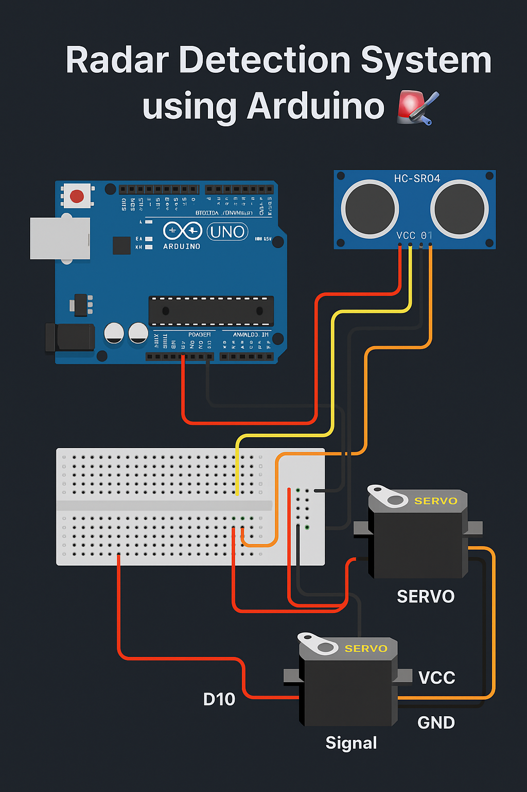

# Radar Detection System using Arduino 🚨📡

This project simulates a radar system using an Arduino UNO, ultrasonic sensor (HC-SR04), and a servo motor. The sensor sweeps across an arc to detect objects at various angles and distances — just like a mini radar!

---

## 🧰 Components Used
- Arduino Uno
- Ultrasonic Sensor (HC-SR04)
- Servo Motor (SG90)
- Jumper Wires
- Breadboard
- USB Cable

---

## 🔧 Circuit Diagram  

---

## 💡 Working Principle
The servo rotates from 0° to 180° while the ultrasonic sensor measures distances at each angle. Data is sent to the serial monitor, simulating a basic radar scanner.

---

## 🧪 How to Run
1. Open `src/radar_detection.ino` in Arduino IDE.
2. Connect your components as shown in the diagram.
3. Select your board and port.
4. Upload and open Serial Monitor at `9600 baud`.

---

## 📦 Dependencies
- Arduino IDE
- Servo library (built-in)
- Ultrasonic sensor (no special library needed)

---

## 👨‍💻 Author
**Jalaluddin Khan**  
BSCS Student, Pakistan  
GitHub: [Your GitHub Link]

---

## 📄 License
This project is licensed under the MIT License - see the [LICENSE](LICENSE) file for details.
